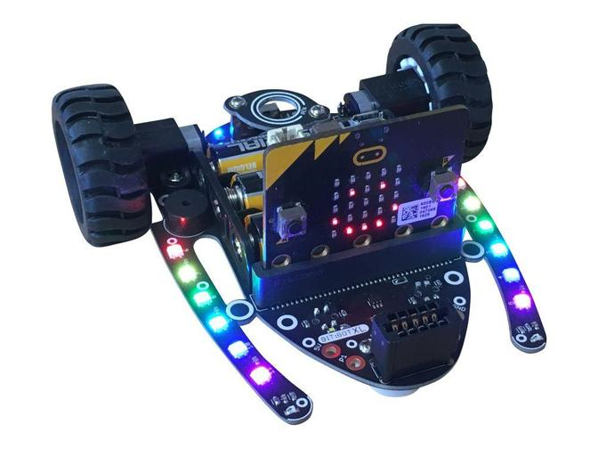

# Introduksjon {.intro}


I denne oppgaven kan du bruke en bit:bot XL som følger med i superbit-pakken.

Her skal vi få bit:boten til å følge den svarte linja på matta. Et annet alternativ 
er å lage sin egen bane med en svart tape på et lyst gulv.



# Steg 1: Vi koder bit:bot-en {.activity}

På undersiden har bit:bot-en to par med sensorer som kan se hva som er under den. 
Det ene paret er digitale sensorer som ser svart (da gir de verdien 1) eller hvitt (som da gir verdien 0). 
Sensorene er plassert på høyre og venstre side av Bit-Boten. 

## Sjekkliste {.check}

- [ ] Start et nytt PXT-prosjekt, for eksempel ved å gå til
      [makecode.microbit.org](https://makecode.microbit.org/?lang=no){target=blank}.

- [ ] Først må du laste inn kodeblokker for bit:bot. Dette gjør du ved å velge `Avansert`{.microbitadvanced}, 
trykke på `Utvidelser`{.microbitadvnced} og lete til du finner bit:bot.

- [ ] Inne i `ved-start`{.microbitbasic} -blokken starter vi med å velge bit:bot-modell og skru på noen led:

```microbit
bitbot.select_model(bitbot.BBModels(BBModel.Classic))
bitbot.neoBrightness(100)
bitbot.neoSetColor(bitbot.BBColours(BBColors.Green))
```

Nå kan vi starte med å lage noen enkle kjøreregler for at bit:bot-en skal følge den svarte linja:

- [ ] Plasserer vi Bit:Boten midt på den svarte linja, vil begge linjesensorene gi verdien 0. 
Da kan den kjøre rett fram. 

- [ ] Hvis den høyre linjesensoren gir verdien __1__, må Bit:Boten svinge litt til høyre for å fortsette å følge linja. 

- [ ] Hvis den venstre linjesensoren gir verdien __1__, må Bit:Boten svinge litt til venstre for å fortsette å følge linja.

Vi kan kode dette slik. Merk at i denne koden testes det ikke for om begge 
linjesesnorene gir __1__ eller begge gir __0__. 

```microbit
bitbot.select_model(bitbot.BBModels(BBModel.Classic))
bitbot.neoBrightness(100)
bitbot.neoSetColor(bitbot.BBColours(BBColors.Green))
basic.forever(function () {
    if (bitbot.readLine(BBLineSensor.Right) == 1) {
        bitbot.driveTurn(BBRobotDirection.Right, 200)
    } else if (bitbot.readLine(BBLineSensor.Left) == 1) {
        bitbot.driveTurn(BBRobotDirection.Left, 200)
    } else {
        bitbot.drive(200)
    }
})
```

## Test prosjektet {.flag}

Da er det bare å teste ut prosjektet og la bit:boten følge linja

- [ ] Klarer den å følge linja ? Du kan endre på hastigheten når den kjører rett fram eller svinger
slik at den klarer å følge linja på en OK måte.

# Steg 2: Noen utfordringer {.activity}

*Noen forslag til endringer og utvidelser, men prøv gjerne egne ideer!*

## Flere ideer {.check}

Bit:bot-en stopper aldri. Her er noen forslag til hva som kan gjøres:

- [ ] Kan du få bit:bot-en til å stoppe etter å ha kjørt en bestemt tid?

- [ ] Kan du lage en svart mål-linje slik at bit:bot-en ser svart med begge sensorene
når den kommer i mål?


